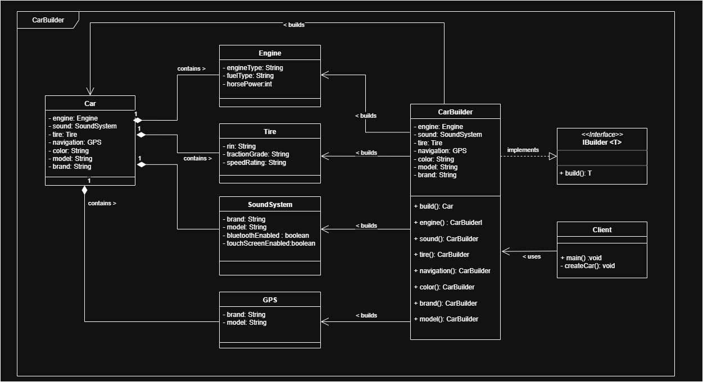
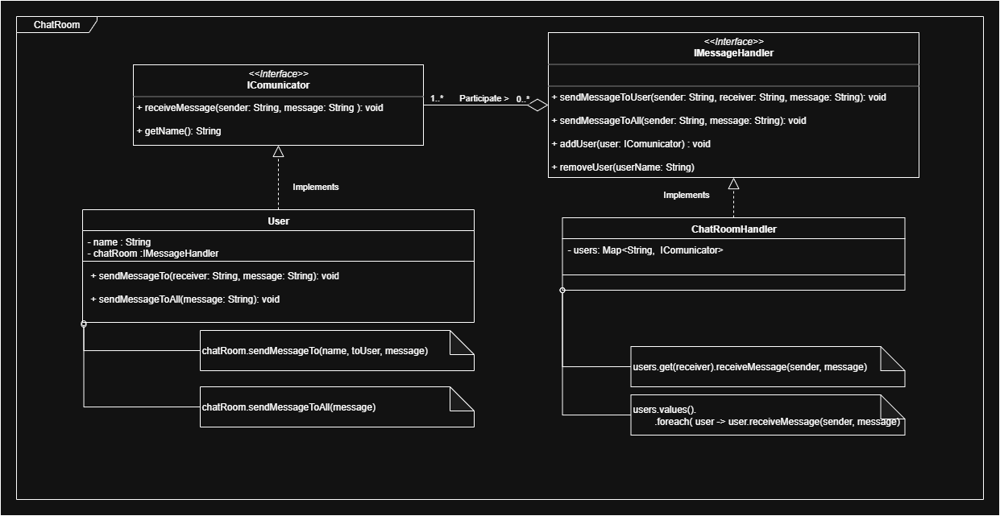

# Escenario 1 — Personalizacion de Automóvil 

<h2>Identificación Patron de Diseño</h2>

<ul>
  <li><b>Tipo de patrón:</b> Creacional</li>
  <li><b>Patrón seleccionado:</b> Builder</li>
</ul>

<h3>Justificación</h3>

El problema describe un objeto complejo, un automovil con diversas configuraciones, las cuales son personalizadas por el cliente de manera opcional.
Asi mismo estas configuraciones son objetos complejos con sus propios estados y comportamientos por lo que la creacion de un automovil requiere una inicializacion ardua,
de sus multiples componentes manualmente. Para mejorar esta situacion el patron BUILDER nos permite crear un automovil paso a paso con valores opcionales.

---

<h2>Beneficios esperados</h2>

  <ul>
    <li><b>Legibilidad y claridad:</b> Facilita la creación de objetos complejos con muchos parámetros sin necesidad de múltiples constructores.</li>
    <li><b>Inmutabilidad:</b> Una vez creado el objeto, sus propiedades no se pueden modificar.</li>
    <li><b>Flexibilidad:</b> Permite omitir atributos opcionales sin necesidad de crear subclases.</li>
    <li><b>Separación de construcción y representación:</b> Separa la lógica de construcción del objeto, facilitando modificaciones futuras.</li>
  </ul>

---

<h2>Diagrama de clases </h2>

# Escenario 3 — Chat Room

<h2>Identificación Patron de Diseño</h2>

<ul>
  <li><b>Tipo de patrón:</b> Comportamiento</li>
  <li><b>Patrón seleccionado:</b> Mediator</li>
</ul>

<h3>Justificación</h3>

El problema describe una comunicacion e interaccion entre multiples componentes, sin embargo sin un mediador cada usuario debera conocer las demas referencias de los participantes en un chat para poder
comunicarse con ellos, lo que genera un alto acoplamiento, sin embargo al usar el patron mediador permite centralizar toda la logica de comuniacion y permte agregar o remover usuarios facilmente.

---

<h2>Beneficios esperados</h2>

  <ul>
    <li><b>Facilita el mantenimiento:</b> Agregar o eliminar usuarios no debe requerir modificar los demás.</li>
    <li><b>Mejor organización:</b> Una vez creado el objeto, sus propiedades no se pueden modificar.</li>
    <li><b>Flexibilidad:</b> La lógica de comunicación debe estar centralizada, no dispersa en muchos objetos.</li>
    <li><b>Reduce la complejidad:</b> Evitar una red enmarañada de interacciones punto a punto.</li>
  </ul>

---

<h2>Diagrama de clases </h2>
